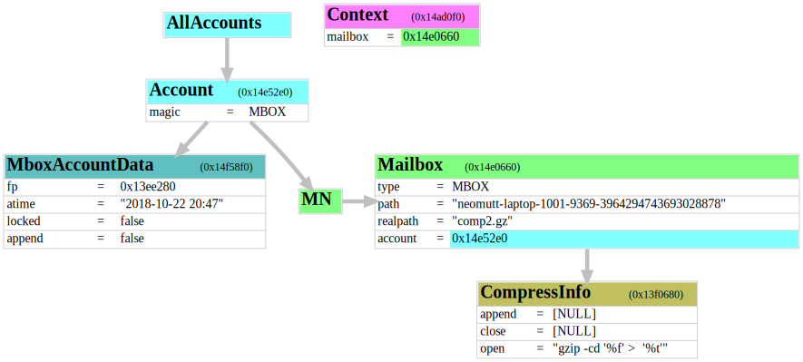
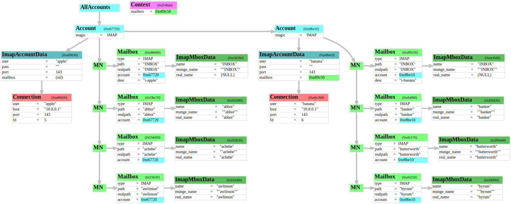
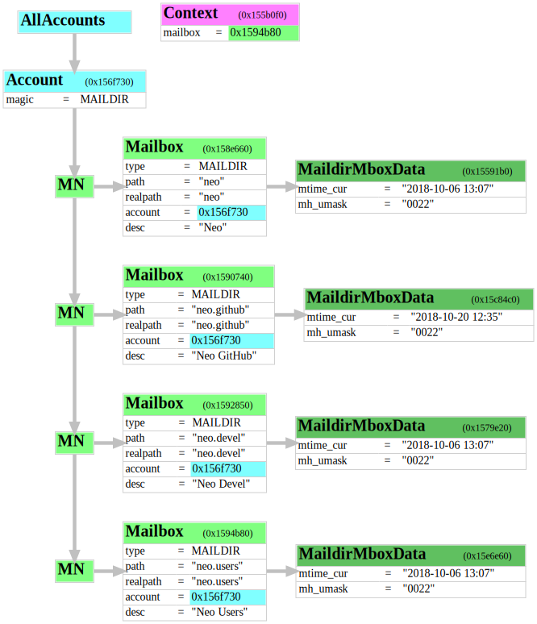
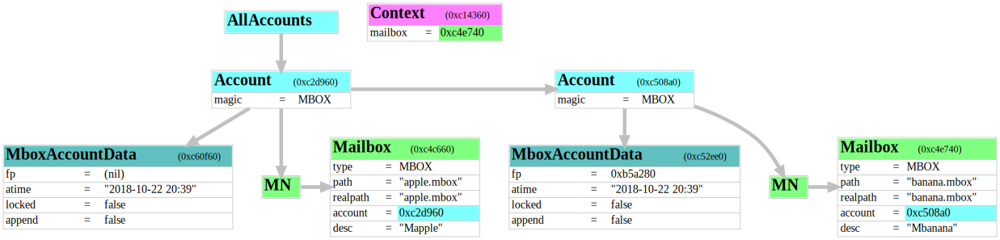
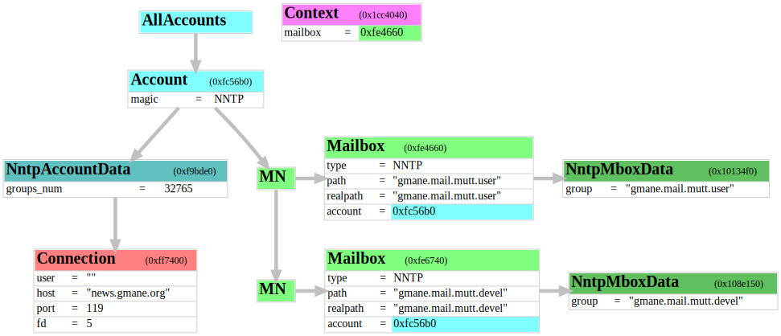
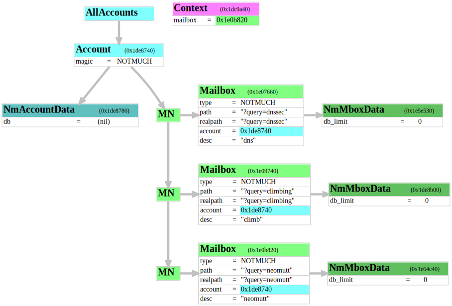
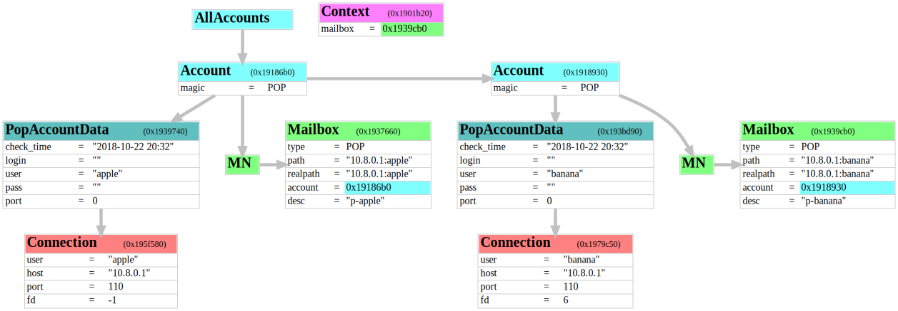
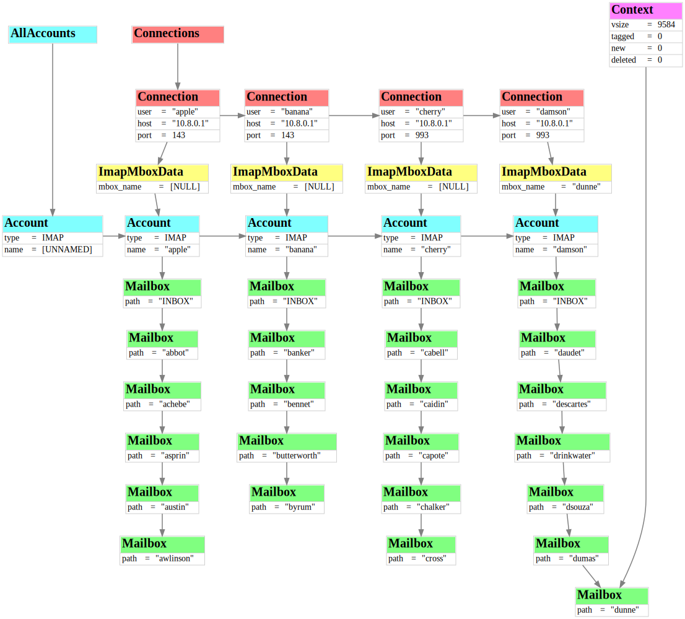

# Account Diagrams

Diagrams showing the internal object layouts of Accounts and Mailboxes within
NeoMutt.

Source file in graphviz format, display version in svg.

**[compress.gv](compress.gv)** **[compress.svg](compress.svg)**

**[imap.gv](imap.gv)** **[imap.svg](imap.svg)**

**[maildir.gv](maildir.gv)** **[maildir.svg](maildir.svg)**

**[mbox.gv](mbox.gv)** **[mbox.svg](mbox.svg)**

**[nntp.gv](nntp.gv)** **[nntp.svg](nntp.svg)**

**[notmuch.gv](notmuch.gv)** **[notmuch.svg](notmuch.svg)**

**[pop.gv](pop.gv)** **[pop.svg](pop.svg)**

**[upstream.gv](upstream.gv)** **[upstream.svg](upstream.svg)**

