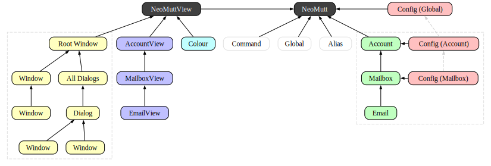
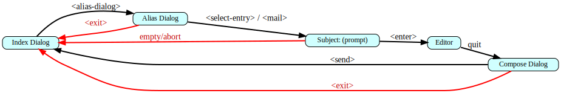
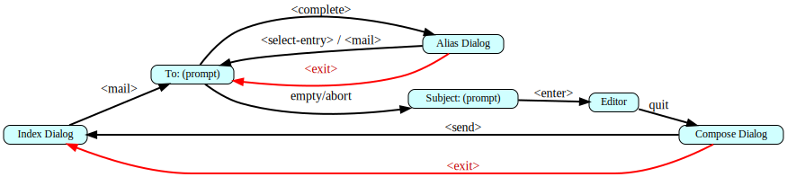
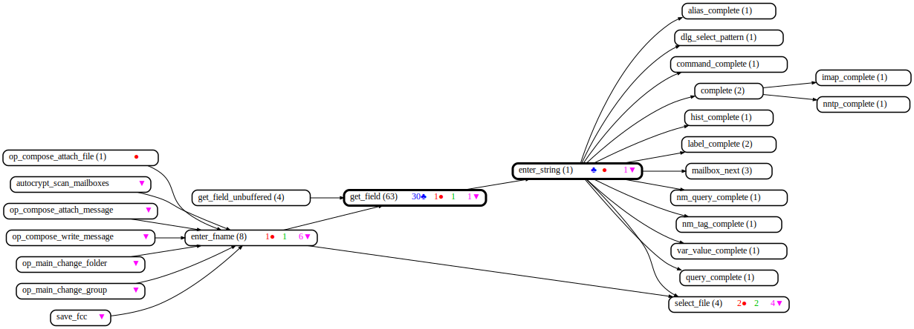
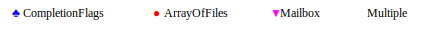

# Architectural Diagrams

Assorted diagrams showing how NeoMutt is assembled.

## Data and Views

<table>
  <tr>
    <td valign="top"></td>
    <td valign="top"><b>Key</b> </td>
  </tr>
  <tr>
    <td valign="top"><a href="arch.svg">svg source</a></td>
    <td valign="top"><a href="arch-key.svg">svg source</a></td>
  </tr>
</table>

## Config and Inheritance

<table>
  <tr>
    <td valign="top"></td>
    <td valign="top"><b>Key</b> </td>
  </tr>
  <tr>
    <td valign="top"><a href="config-arch.svg">svg source</a></td>
    <td valign="top"><a href="config-arch-key.svg">svg source</a></td>
  </tr>
</table>

## Notifications

**[notify.gv](notify.gv)** **[notify.svg](notify.svg)**

## Components

**[components.svg](components.svg)**

## Email Library

**[libemail.gv](libemail.gv)** **[libemail.svg](libemail.svg)**

## Mutt Library

**[libmutt.gv](libmutt.gv)** **[libmutt.svg](libmutt.svg)**

## Observers

**[observer.svg](observer.svg)**

## Alias / Query - Dialog / Completion

The Alias and Query Dialogs work the same way as each other.
These state diagrams show how direct access and auto-completion work.

**[direct.gv](direct.gv)** **[direct.svg](direct.svg)**

**[complete.gv](complete.gv)** **[complete.svg](complete.svg)**

## Auto-Completion

Auto-completion starts deep in the `enter_string()` function.
This function diagram shows all the callers and dependencies.

**[enter-field.gv](enter-field.gv)** **[enter-field.svg](enter-field.svg)**

**[enter-field-key.gv](enter-field-key.gv)** **[enter-field-key.svg](enter-field-key.svg)**

