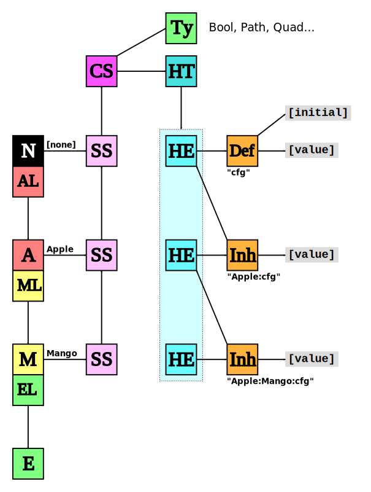
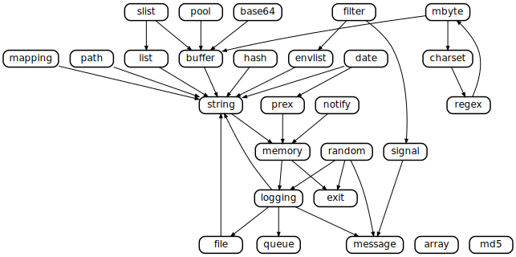

# Architectural Diagrams

Assorted diagrams showing how NeoMutt is assembled.

**[arch-key.svg](arch-key.svg)** **[arch.svg](arch.svg)**

**[config-arch-key.svg](config-arch-key.svg)** **[config-arch.svg](config-arch.svg)**

**[components.svg](components.svg)**

**[libemail.gv](libemail.gv)** **[libemail.svg](libemail.svg)**

**[libmutt.gv](libmutt.gv)** **[libmutt.svg](libmutt.svg)**

**[observer.svg](observer.svg)**

