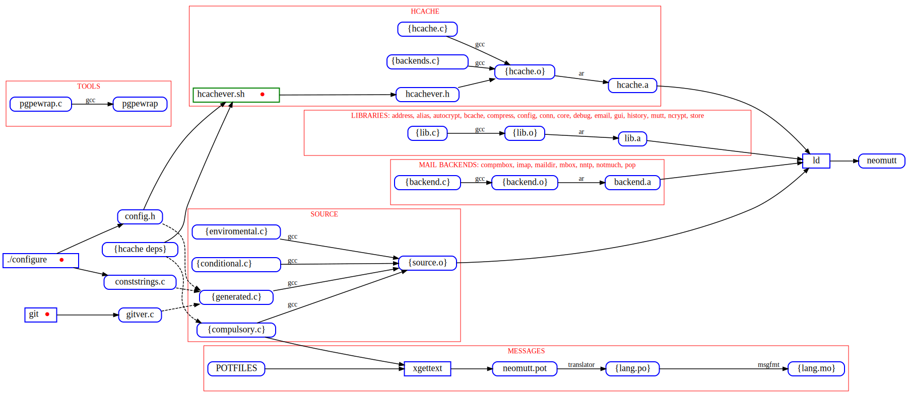
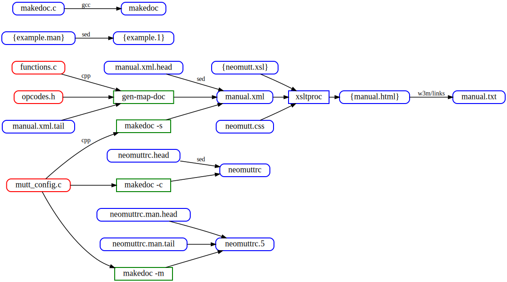
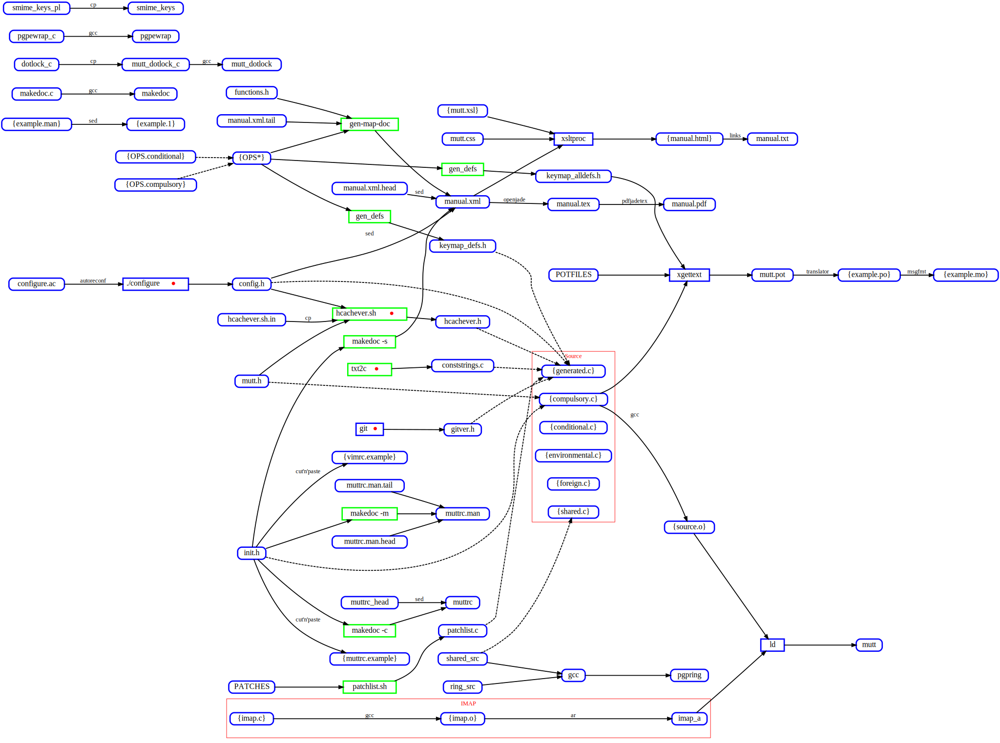

# How to Build NeoMutt

How to [build NeoMutt](https://neomutt.org/dev/make).
Source file in graphviz format, display version in svg.

**[make-code.gv](make-code.gv)** **[make-code.svg](make-code.svg)**

**[make-docs.gv](make-docs.gv)** **[make-docs.svg](make-docs.svg)**

**[make-orig.gv](make-orig.gv)** **[make-orig.svg](make-orig.svg)**

