# Keybindings

## alias

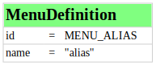 

<table>
  <tr>
    <td valign="top">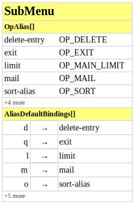</td>
    <td valign="top">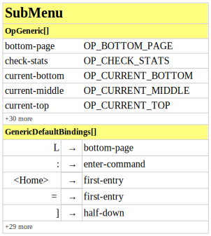</td>
  </tr>
  <tr>
    <td valign="top"><a href="sub_alias.svg">svg source</a></td>
    <td valign="top"><a href="sub_generic.svg">svg source</a></td>
  </tr>
</table>

## attach

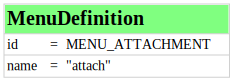 

<table>
  <tr>
    <td valign="top">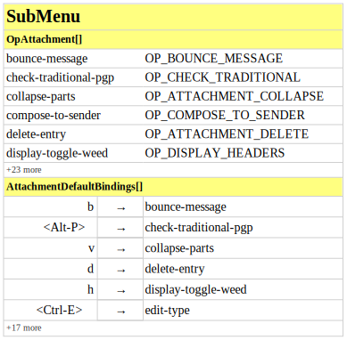</td>
    <td valign="top"></td>
  </tr>
  <tr>
    <td valign="top"><a href="sub_attach.svg">svg source</a></td>
    <td valign="top"><a href="sub_generic.svg">svg source</a></td>
  </tr>
</table>

## autocrypt

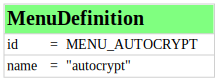 

<table>
  <tr>
    <td valign="top">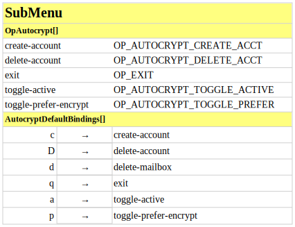</td>
    <td valign="top"></td>
  </tr>
  <tr>
    <td valign="top"><a href="sub_autocrypt.svg">svg source</a></td>
    <td valign="top"><a href="sub_generic.svg">svg source</a></td>
  </tr>
</table>

## browser

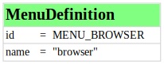 

<table>
  <tr>
    <td valign="top">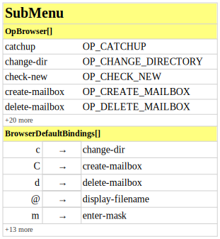</td>
    <td valign="top"></td>
  </tr>
  <tr>
    <td valign="top"><a href="sub_browser.svg">svg source</a></td>
    <td valign="top"><a href="sub_generic.svg">svg source</a></td>
  </tr>
</table>

## compose

 

<table>
  <tr>
    <td valign="top">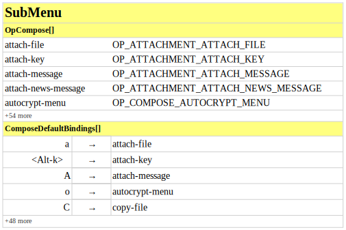</td>
    <td valign="top"></td>
  </tr>
  <tr>
    <td valign="top"><a href="sub_compose.svg">svg source</a></td>
    <td valign="top"><a href="sub_generic.svg">svg source</a></td>
  </tr>
</table>

## dialog

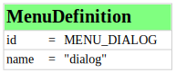 

<table>
  <tr>
    <td valign="top">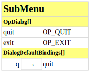</td>
    <td valign="top"></td>
  </tr>
  <tr>
    <td valign="top"><a href="sub_dialog.svg">svg source</a></td>
    <td valign="top"><a href="sub_generic.svg">svg source</a></td>
  </tr>
</table>

## editor

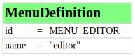 

<table>
  <tr>
    <td valign="top">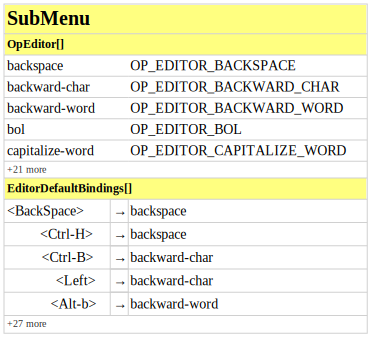</td>
  </tr>
  <tr>
    <td valign="top"><a href="sub_editor.svg">svg source</a></td>
  </tr>
</table>

## generic

 

<table>
  <tr>
    <td valign="top"></td>
  </tr>
  <tr>
    <td valign="top"><a href="sub_generic.svg">svg source</a></td>
  </tr>
</table>

## index

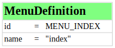 

<table>
  <tr>
    <td valign="top">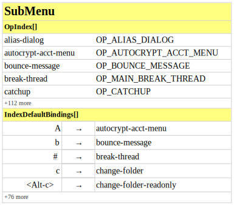</td>
    <td valign="top">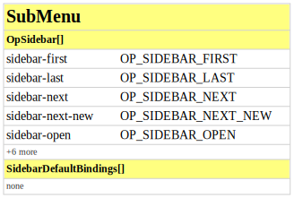</td>
    <td valign="top"></td>
  </tr>
  <tr>
    <td valign="top"><a href="sub_index.svg">svg source</a></td>
    <td valign="top"><a href="sub_sidebar.svg">svg source</a></td>
    <td valign="top"><a href="sub_generic.svg">svg source</a></td>
  </tr>
</table>

## pager

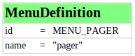 

<table>
  <tr>
    <td valign="top">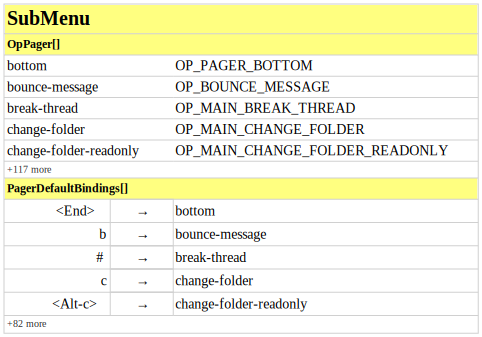</td>
    <td valign="top"></td>
  </tr>
  <tr>
    <td valign="top"><a href="sub_pager.svg">svg source</a></td>
    <td valign="top"><a href="sub_sidebar.svg">svg source</a></td>
  </tr>
</table>

## pgp

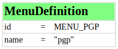 

<table>
  <tr>
    <td valign="top">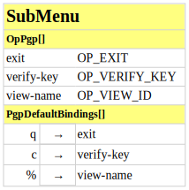</td>
    <td valign="top"></td>
  </tr>
  <tr>
    <td valign="top"><a href="sub_pgp.svg">svg source</a></td>
    <td valign="top"><a href="sub_generic.svg">svg source</a></td>
  </tr>
</table>

## postpone

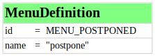 

<table>
  <tr>
    <td valign="top">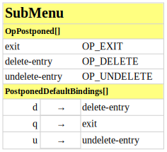</td>
    <td valign="top"></td>
  </tr>
  <tr>
    <td valign="top"><a href="sub_postpone.svg">svg source</a></td>
    <td valign="top"><a href="sub_generic.svg">svg source</a></td>
  </tr>
</table>

## query

 

<table>
  <tr>
    <td valign="top">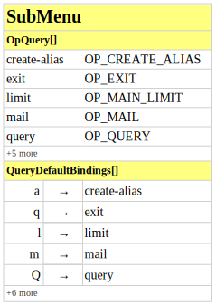</td>
    <td valign="top"></td>
  </tr>
  <tr>
    <td valign="top"><a href="sub_query.svg">svg source</a></td>
    <td valign="top"><a href="sub_generic.svg">svg source</a></td>
  </tr>
</table>

## sidebar

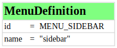 

<table>
  <tr>
    <td valign="top"></td>
  </tr>
  <tr>
    <td valign="top"><a href="sub_sidebar.svg">svg source</a></td>
  </tr>
</table>

## smime

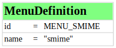 

<table>
  <tr>
    <td valign="top">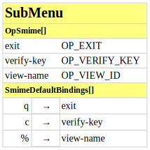</td>
    <td valign="top"></td>
  </tr>
  <tr>
    <td valign="top"><a href="sub_smime.svg">svg source</a></td>
    <td valign="top"><a href="sub_generic.svg">svg source</a></td>
  </tr>
</table>

