# Layout

Diagrams of the Window Layout of NeoMutt

## Plain Index View

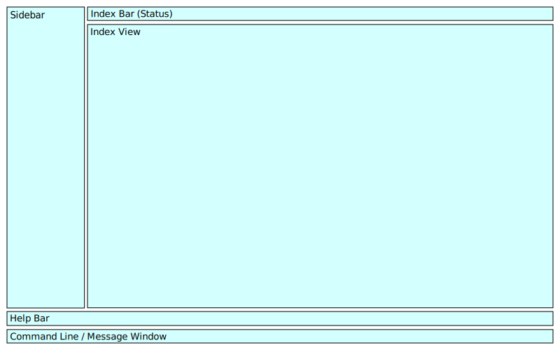
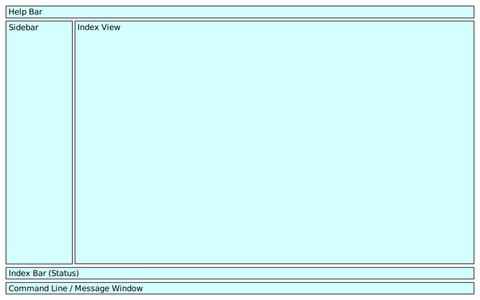

- Help Line
- Sidebar
- Index View
- Status Bar
- Command Line / Message Window

The second has a shortened index bar (status).

## Index + Pager View

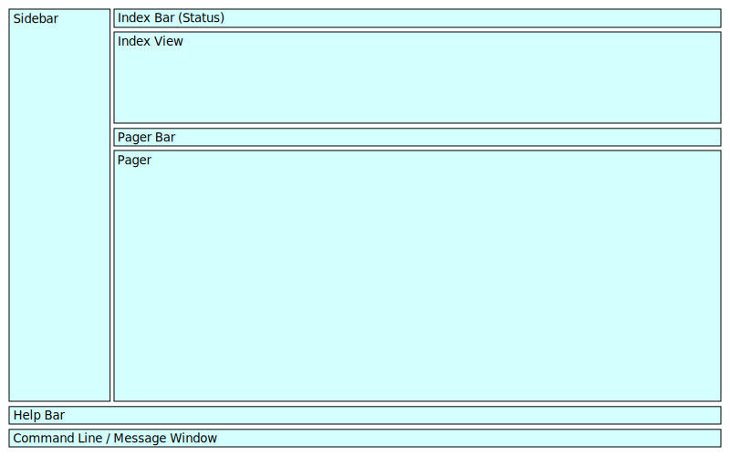
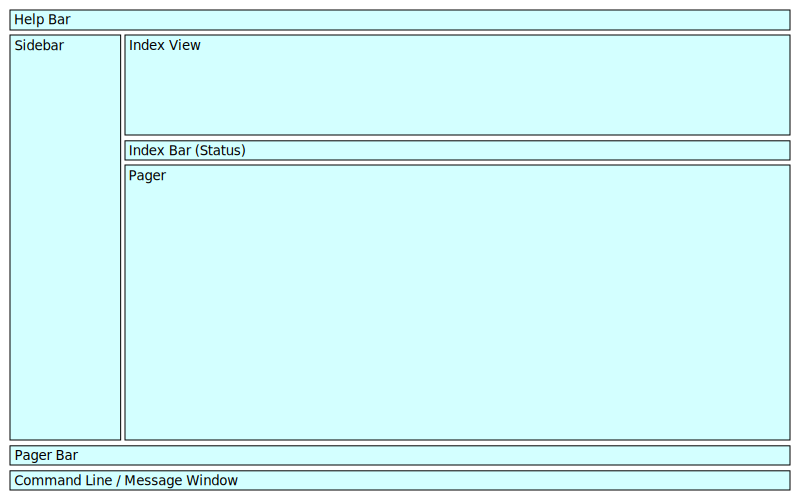

- Help Line
- Sidebar
- Index View
- Status Bar
- Pager
- Pager Bar
- Command Line / Message Window

Second has status_on_top set

## Window Hierarchy

- Vertical container
  - Help Line
  - Horizontal container
    - Sidebar
    - Vertical container
      - Index View
      - Status Bar
      - Pager
  - Pager Bar
  - Command Line / Message Window

## Index + Pager View (shortened index bar)

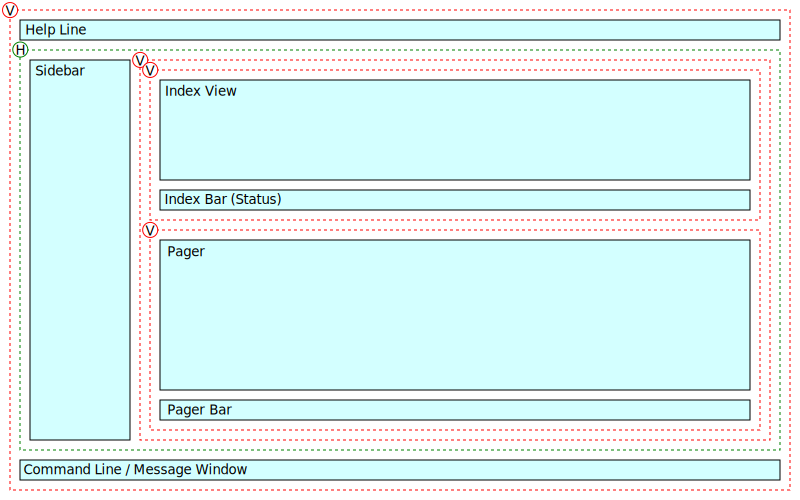
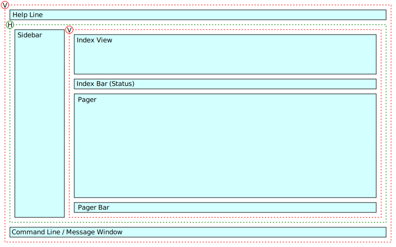
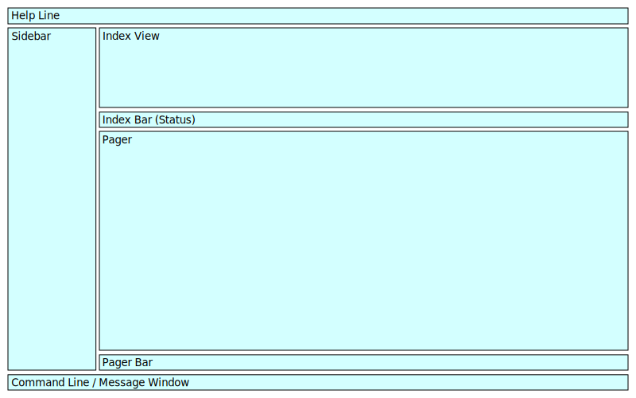

- Status Bar
- Sidebar
- Index View
- Pager Bar
- Pager
- Help Line
- Command Line / Message Window

The third has an extra vertical nest to separate the index from the pager.

## Index + Pager View (status on top, shortened index bar)

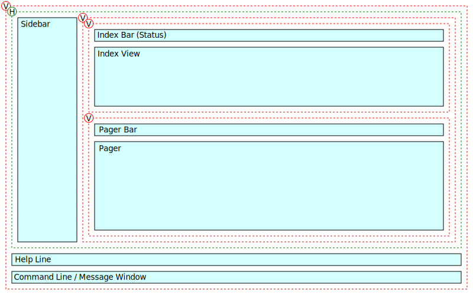
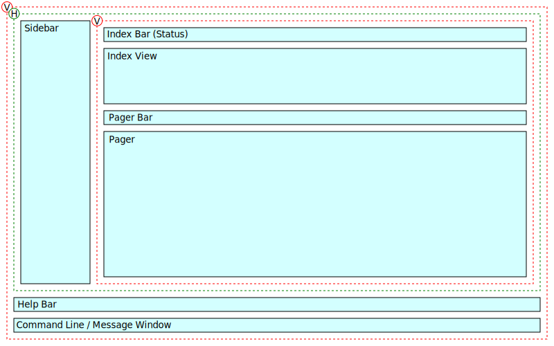

- Status Bar
- Sidebar
- Index View
- Pager Bar
- Pager
- Help Line
- Command Line / Message Window

The third has an extra vertical nest to separate the index from the pager.

## Widescreen

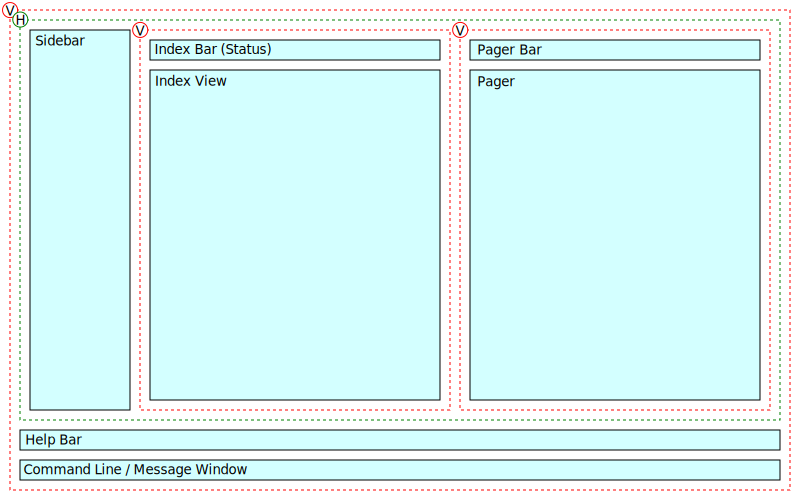
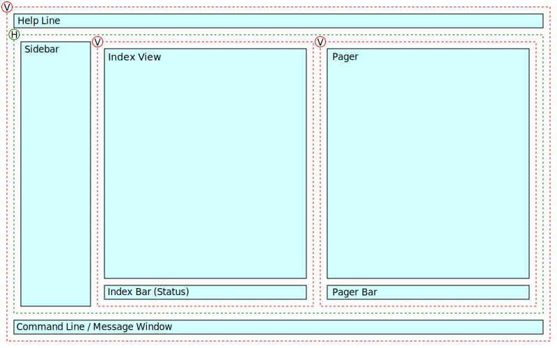
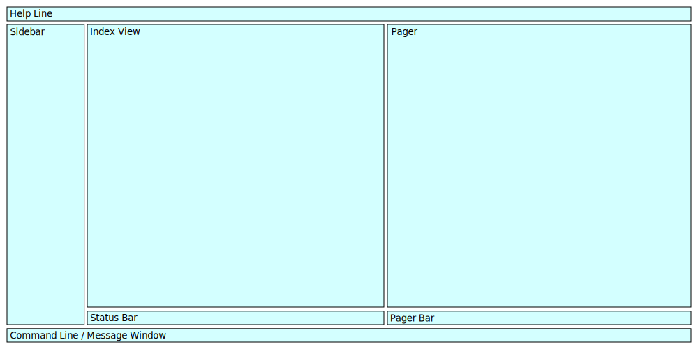

An idea, not implemented.

- Help Line
- Sidebar
- Index View
- Pager
- Status Bar
- Pager Bar
- Command Line / Message Window

The third has status_on_top set.

## Email Comparison View

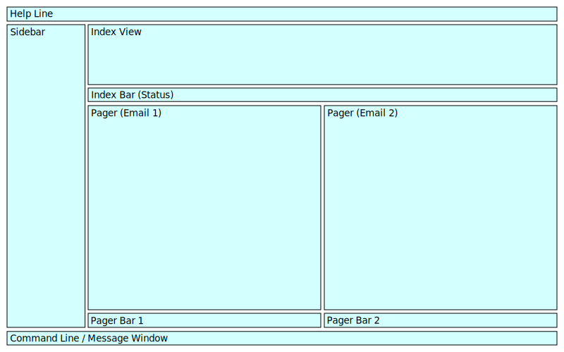

An idea, not implemented.

- Help Line
- Sidebar
- Index View
- Pager Bar 1
- Pager Bar 2
- Pager 1
- Pager 2
- Status Bar
- Command Line / Message Window

## Multiple Views

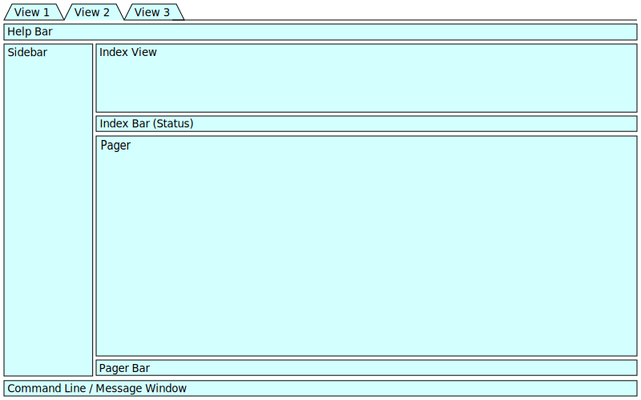

An idea, not implemented.

- View Tabs
- Help Line
- Sidebar
- Index View
- Status Bar
- Pager
- Pager Bar
- Command Line / Message Window

