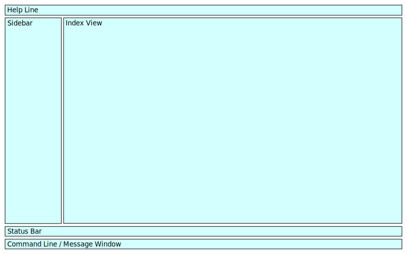
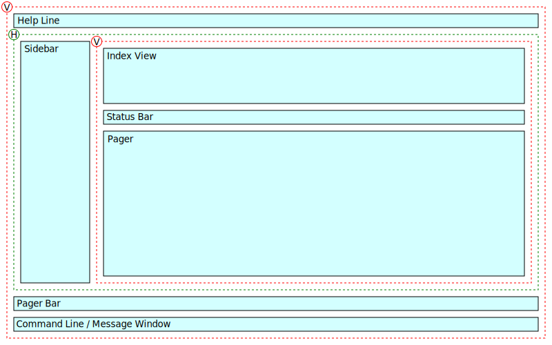
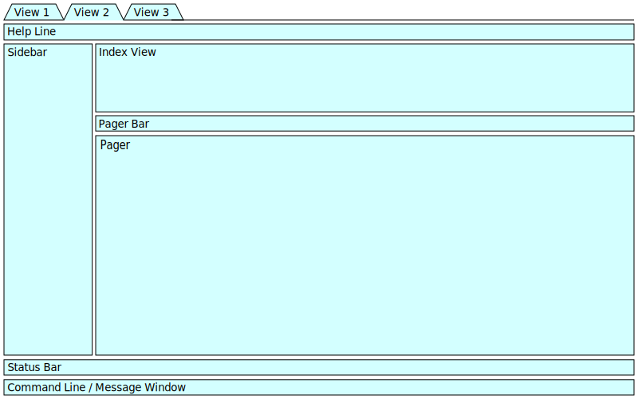
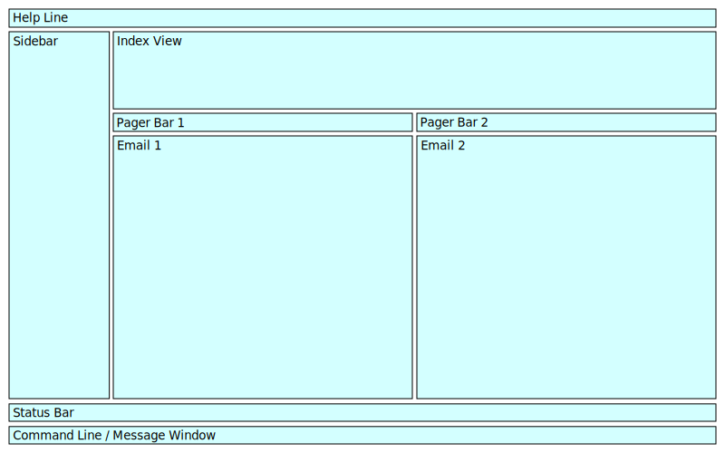

# Layout

Diagrams of the Window Layout of NeoMutt

## Index View

- Help Line
- Sidebar
- Index View
- Status Bar
- Command Line / Message Window

## Pager View

- Help Line
- Sidebar
- Index View
- Status Bar
- Pager
- Pager Bar
- Command Line / Message Window

## Pager View (status on top)

- Status Bar
- Sidebar
- Index View
- Pager Bar
- Pager
- Help Line
- Command Line / Message Window

## Window Hierarchy

- Vertical container
  - Help Line
  - Horizontal container
    - Sidebar
    - Vertical container
      - Index View
      - Status Bar
      - Pager
  - Pager Bar
  - Command Line / Message Window

## Multiple Views

An idea, not implemented.

- View Tabs
- Help Line
- Sidebar
- Index View
- Status Bar
- Pager
- Pager Bar
- Command Line / Message Window

## Email Comparison View

An idea, not implemented.

- Help Line
- Sidebar
- Index View
- Pager Bar 1
- Pager Bar 2
- Pager 1
- Pager 2
- Status Bar
- Command Line / Message Window

## Widescreen

An idea, not implemented.

- Help Line
- Sidebar
- Index View
- Pager
- Status Bar
- Pager Bar
- Command Line / Message Window

