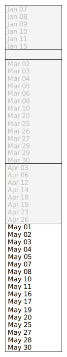

# Notmuch Windowed Queries

Config:

```sh
set nm_query_window_enable = yes
set nm_query_window_duration = 1
set nm_query_window_timebase = month
```

The query returns 45 results from the over the last six months.  
NeoMutt applies the window rules and only displays the most recent matches.

The initial **window** is shown on the left.




Using the functions:

- `<vfolder-window-backward>`  
  Moves the window backwards in time by `$nm_query_window_duration` * `$nm_query_window_timebase` (1 month)  
  (the diagram to the right)

- `<vfolder-window-forward>`  
  Moves the window forwards in time by `$nm_query_window_duration` * `$nm_query_window_timebase` (1 month)  
  (the diagram to the left)

- `<vfolder-window-reset>`  
  Resets the window to the present time  
  (the first diagram)

**Note**: The 'February' window doesn't contain any results.
